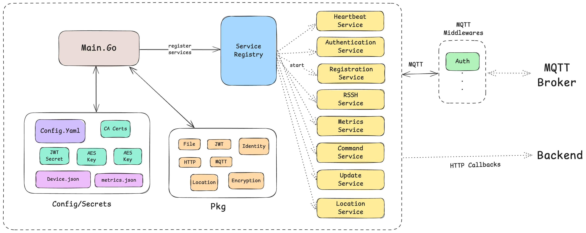

# IoT Agent

A modular and configurable **IoT agent** designed to support a variety of services and operate on any Unix-based system. It enables secure communication and interaction with an MQTT backend. You can use [IOT-Cloud](https://github.com/BenMeehan/iot-cloud) or build your own MQTT backend.

## Features

- Modular service-based architecture  
- Secure communication via MQTT  
- Supports multiple services (Registration, Metrics, SSH, Updates, etc.)  
- Configurable through YAML files  
- Designed for low-resource IoT devices  

## Installation & Setup

### 1. Clone the Repository

```sh
git clone https://github.com/BenMeehan/iot-agent.git
cd iot-agent
```

### 2. Configure the Agent

Modify `config/config.yaml` to suit your requirements. Ensure correct MQTT broker settings and service configurations.

### 3. Run the Agent

```sh
go run cmd/agent/main.go
```

## Configuration

The agent is configured via `config/config.yaml`. Each service has its own parameters, such as MQTT topics, intervals, and authentication details.

For detailed service-specific documentation, refer to the [`/docs`](./docs/) folder.

## Roadmap

- [ ] **Cross-Compilation**: Simplify compilation for different architectures.

## Architecture



## Adding a New Service

To add a new service, follow these steps:

1. **Update Configuration**  
   - Add the necessary configurations in `config/config.yaml`.

2. **Create Service Logic**  
   - Add a new file in `internal/services` (e.g., `new_service.go`).  
   - Implement the service logic, following the pattern of existing services (e.g., `heartbeat_service.go`).

## Middlewares Overview

### 1. Authentication Middlware
- Handles the JWT based authentication at a central place.
- Retries Auth requests and refreshes expired tokens.

## Services Overview

Detailed service documentation is available in the [`/docs`](./docs/) directory.

### 1. Registration Service
- Handles secure device registration via MQTT using JWT authentication.
- Implements exponential backoff for retries.

### 2. Heartbeat Service
- Sends periodic heartbeat messages to indicate device activity.

### 3. Metrics Service
- Collects system metrics (CPU, memory, disk usage, network in/out, process metrics) and sends them via MQTT.

### 4. Command Service
- Executes commands on the IoT device and publishes output via MQTT.

### 5. Geolocation Service
- Retrieves device location via GPS or Google Geolocation API.

### 6. SSH Service
- Establishes a secure reverse SSH tunnel for remote access.

### 7. Update Service
- Handles OTA (Over-the-Air) updates for firmware or software.

## Code Guidelines

### 1. Naming Conventions
- Use camel case for variables and constants (e.g., `deviceId`, `maxRetries`).
- Use snake case for files and folders (e.g., `heartbeat_service.go`).

### 2. Code Style
- Maintain clean and readable code.
- Comments should explain **why** something is done, not just **what** it does.

### 3. Logging
- Use structured logs with relevant context.
- Ensure logs provide meaningful information for debugging.

---

This project is licensed under the [Non-Commercial Software License 1.0](./LICENSE.md).
