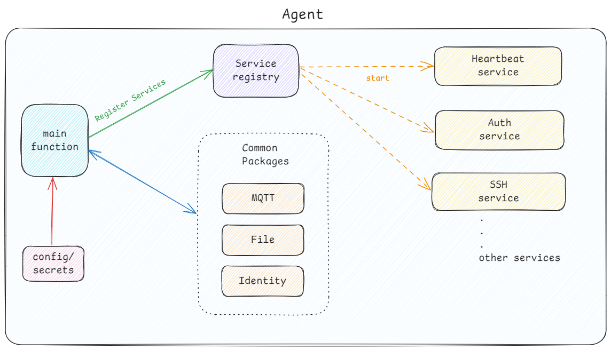

# IoT Agent

A generalized IoT agent designed to be modular, configurable, supporting a variety of services, and designed to run on any Unix-based system. You can use [IOT-Cloud](https://github.com/BenMeehan/iot-cloud) or build your own MQTT backend.

Pre-Alpha Discussions: [Here](https://github.com/BenMeehan/iot-agent/discussions/6)

## Running the Project

To run the project, use:
```sh
go run cmd/agent/main.go
```
TODO:
1. SSH Service
2. Update Service
3. **Metrics Service**
4. Easier Cross-Compilation for different architectures

## Architecture


## Adding a New Service

1. **Update Configuration**:
   - Add necessary configurations in `config/config.yaml`.

2. **Create Service Logic**:
   - Add a new file in `internal/services` (e.g., `new_service.go`).
   - Implement the service logic similar to existing services (e.g., `heartbeat_service.go`).

## Services Overview

### Registration Service

- **Purpose**: Handles the registration of IoT devices with the server.
- **Configuration Parameters**:
  - `PubTopic`: The MQTT topic to publish registration messages.
  - `DeviceSecretFile`: Path to the file containing device secrets.
  - `ClientID`: The unique client identifier used for MQTT communication.
  - `QOS`: Quality of Service level for MQTT messages.
- **Behavior**: Publishes registration data to the MQTT broker to register the device. If the `device.json` file contains a `deviceID`, then the device is already registered, and we use that. Otherwise, we do a secure registration through a PSK hash for authentication.

### Heartbeat Service

- **Purpose**: Periodically sends heartbeat messages to indicate the device is active.
- **Configuration Parameters**:
  - `PubTopic`: The MQTT topic to publish heartbeat messages.
  - `Interval`: Interval in seconds between heartbeat messages.
  - `DeviceID`: The unique identifier for the device.
  - `QOS`: Quality of Service level for MQTT messages.
- **Behavior**: Sends heartbeat messages at regular intervals to the MQTT broker to indicate that the device is still operational.

### Metrics Service

- **Purpose**: Collects and sends system and process metrics from the IoT device to a backend for monitoring and analysis.
- **Configuration Parameters**:
  - `PubTopic`: The MQTT topic to publish metrics data.
  - `QOS`: Quality of Service level for MQTT messages.
  - `Interval`: The interval in seconds to collect metrics (if applicable).
  - `DeviceID`: The unique identifier for the device.
- **Behavior**: Collects metrics such as CPU usage, memory, disk space, and network usage, along with specific process metrics. The service publishes this data to the configured MQTT broker at regular intervals or upon changes. Metrics are configurable through a json file.

## Rules

1. **Naming Conventions**:
   - Use camel case for variables and constants (e.g., `deviceId`, `maxRetries`).
   - Use snake case for file names and folder names (e.g., `heartbeat_service.go`, `internal/services`).

2. **Code Style**:
   - Ensure code readability with clear, concise naming and consistent formatting.
   - Include meaningful comments where necessary but avoid over-commenting. Comments should explain why something is done, not just what is done.

3. **Logging**:
   - Use structured logging with a clear message and relevant context.
   - Ensure logs are informative and useful for debugging purposes.

## URLs

- [EMQX Public MQTT5 Broker](https://www.emqx.com/en/mqtt/public-mqtt5-broker)
- [MQTT Test Client](https://testclient-cloud.mqtt.cool/)
