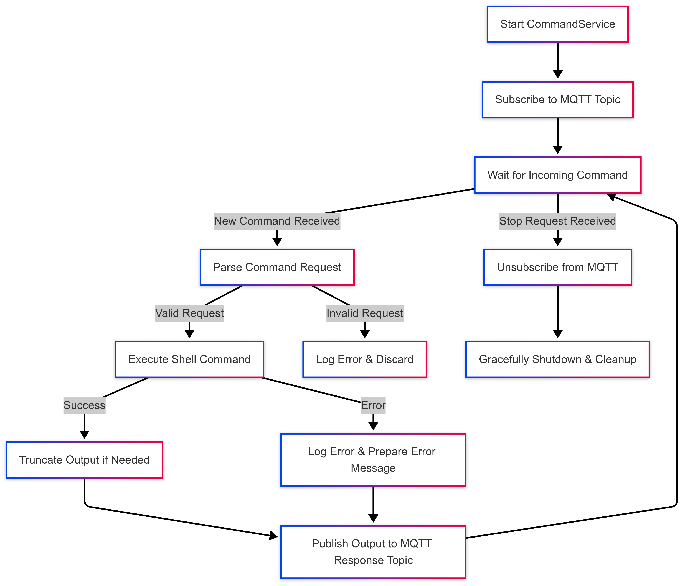

# **Command Service**

## **Overview**
The **Command Service** is responsible for executing shell commands received via MQTT messages and publishing the results back to a specified response topic. It is designed to be efficient, secure, and responsive, ensuring that commands are processed within defined execution limits.

## **Service Flow**

### 1. **Initialization**
- The service is initialized with configurable parameters such as the MQTT subscription topic, quality of service (QoS), output size limit, and maximum execution time.
- A context with cancellation is created to manage graceful shutdowns.
- Dependencies such as MQTT middleware, device information, and logging are injected.

### 2. **Starting the Service**
- The service subscribes to an MQTT topic derived from the device ID.
- Upon successful subscription, it starts listening for incoming command requests.

### 3. **Handling Incoming Commands**
- When a message is received on the subscribed MQTT topic, it is processed asynchronously.
- The payload is parsed into a command request containing the user ID and command string.
- The command is then executed within a controlled environment.

### 4. **Executing the Command**
- The service runs the shell command using a restricted execution context.
- A timeout is enforced to prevent long-running or hanging processes.
- Standard output and error are captured.
- If execution fails or times out, an appropriate error response is generated.

### 5. **Processing Output**
- The output is truncated if it exceeds a predefined size limit.
- Warnings are logged if truncation occurs to maintain transparency.

### 6. **Publishing the Response**
- The command execution result is formatted into a structured response.
- The response is published to a designated MQTT topic.
- If publishing fails, errors are logged, and retry mechanisms may be considered.

### 7. **Graceful Shutdown**
- The service can be stopped gracefully by:
  - Cancelling the context to stop execution.
  - Closing the MQTT subscription.
  - Ensuring that all ongoing command executions complete before exiting.
