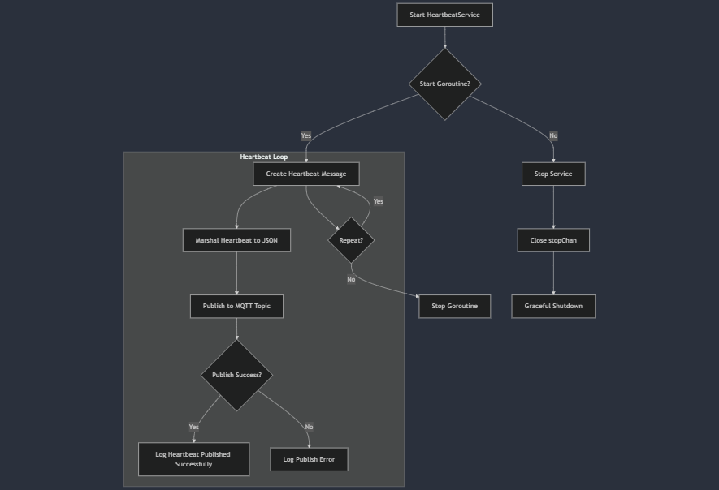

# Heartbeat Service Documentation

## Overview
The `HeartbeatService` is responsible for sending periodic heartbeat messages to an MQTT broker to indicate that the device is alive and active. The heartbeat message includes the device's ID, a timestamp, the device's status, and a JWT (JSON Web Token) for authentication. This service runs continuously in the background and can be started and stopped gracefully.



## **Struct: HeartbeatService**

```go
type HeartbeatService struct {
    PubTopic   string
    Interval   time.Duration
    DeviceInfo identity.DeviceInfoInterface
    QOS        int
    MqttClient mqtt.MQTTClient
    JWTManager jwt.JWTManagerInterface
    Logger     *logrus.Logger
    stopChan   chan struct{}
}
```

## **Fields:**

1. **`PubTopic` (string):**
   - This is the MQTT topic to which the heartbeat messages will be published. It is defined during the creation of the service.

2. **`Interval` (time.Duration):**
   - The time interval between each heartbeat message. It defines how frequently the heartbeat messages will be sent (e.g., every 10 seconds or every minute).

3. **`DeviceInfo` (identity.DeviceInfoInterface):**
   - An interface that provides information about the device. It is used to fetch the device's unique ID, which will be included in the heartbeat message.

4. **`QOS` (int):**
   - Quality of Service (QoS) level for MQTT message delivery. It determines the reliability of message delivery:
     - 0: "At most once" delivery (messages may be lost).
     - 1: "At least once" delivery (messages will be delivered but may be duplicated).
     - 2: "Exactly once" delivery (messages are guaranteed to be delivered exactly once).

5. **`MqttClient` (mqtt.MQTTClient):**
   - The MQTT client used to communicate with the broker. It is used to publish messages to the MQTT topic.

6. **`JWTManager` (jwt.JWTManagerInterface):**
   - An interface that handles generating or retrieving JWT tokens for the device. The JWT is included in the heartbeat message for authentication purposes.

7. **`Logger` (*logrus.Logger):**
   - A logger used to log errors and status messages during the operation of the heartbeat service.

8. **`stopChan` (chan struct{}):**
   - A channel used to signal the heartbeat service to stop. It is used to gracefully terminate the goroutine running the heartbeat loop.

---

## **Methods:**

1. **`Start()`**
   
   The `Start` method initiates the heartbeat service by starting a new goroutine that publishes heartbeat messages at regular intervals.

   ```go
   func (h *HeartbeatService) Start() error
   ```

   - **Description:**
     - This method starts a goroutine that runs a loop with a ticker that triggers the publishing of heartbeat messages at the defined `Interval`.
     - Each time the ticker ticks, the following steps are performed:
       - A `Heartbeat` struct is created with the device's ID, the current timestamp, the device status (`StatusAlive`), and the JWT token.
       - The heartbeat message is serialized into JSON format.
       - The serialized message is published to the MQTT broker on the specified `PubTopic` with the defined QoS.
       - If there is an error during message serialization or publishing, the error is logged.
     - The loop will continue running until the `Stop` method is called, which sends a signal through the `stopChan` channel.

   - **Parameters:**
     - No parameters.

   - **Returns:**
     - `error`: An error object if the initialization or starting process encounters an error.

2. **`Stop()`**

   The `Stop` method gracefully stops the heartbeat service by closing the `stopChan`, which will signal the goroutine to exit the loop.

   ```go
   func (h *HeartbeatService) Stop()
   ```

   - **Description:**
     - When this method is called, it closes the `stopChan` channel. The goroutine listening on this channel will receive the signal and exit its loop, effectively stopping the heartbeat service.
     - After calling `Stop()`, the heartbeat service will no longer send heartbeat messages.

   - **Parameters:**
     - No parameters.

   - **Returns:**
     - No return values.

---

## **Heartbeat Message Structure:**

The heartbeat message is represented by the `models.Heartbeat` struct, which contains the following fields:

```go
type Heartbeat struct {
    DeviceID  string    `json:"device_id"`
    Timestamp time.Time `json:"timestamp"`
    Status    string    `json:"status"`
    JWTToken  string    `json:"jwt_token"`
}
```

- **`DeviceID` (string):**
  - The unique identifier of the device that is sending the heartbeat message.

- **`Timestamp` (time.Time):**
  - The timestamp indicating when the heartbeat message was sent.

- **`Status` (string):**
  - The status of the device. Typically, this is set to `StatusAlive` to indicate that the device is online and functioning.

- **`JWTToken` (string):**
  - The JSON Web Token (JWT) used for authentication. This token is managed by the `JWTManager` and is included in the heartbeat message to verify the identity of the device.

---

## **Error Handling:**

The service contains error handling to ensure that any issues encountered during the heartbeat process are logged:

- **Serialization Errors:**
  - If there is an issue with marshalling the `Heartbeat` struct into JSON, an error will be logged using `h.Logger.WithError(err).Error("failed to serialize heartbeat message")`.

- **Publishing Errors:**
  - If there is an issue while publishing the message to the MQTT broker, an error will be logged using `h.Logger.WithError(err).Error("failed to publish heartbeat message")`.

- **Successful Heartbeat:**
  - When the heartbeat message is successfully published, a log entry is generated to indicate success: `h.Logger.WithField("message", heartbeatMessage).Info("Heartbeat published successfully")`.

---
