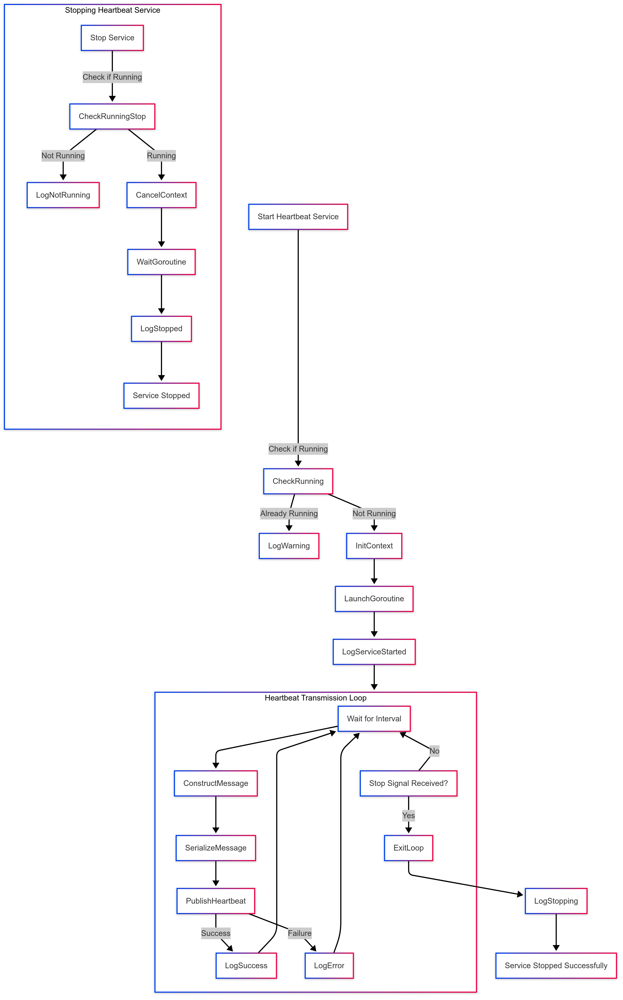

# **Heartbeat Service**  

## **Overview**  
The `HeartbeatService` is responsible for **sending periodic heartbeat messages** from an IoT device to an MQTT broker. These messages help monitor the device's availability and operational status.

## **Service Flow**  

1. **Service Initialization**  
   - The service is initialized with a **publish topic**, a **time interval**, and a **Quality of Service (QoS) level**.  
   - Dependencies include:
     - `deviceInfo` for retrieving the device's identity.
     - `mqttMiddleware` for handling MQTT communication.
     - `logger` for logging system events.

2. **Starting the Service**  
   - The service checks if it is already running. If yes, it logs a warning and prevents duplicate execution.  
   - It creates a **context** to manage the lifecycle of the heartbeat process.  
   - A **goroutine** is launched to run the heartbeat loop asynchronously.

3. **Heartbeat Transmission Loop**  
   - Runs continuously at the configured interval.  
   - On each cycle:
     - **Constructs a heartbeat message** with the device ID, timestamp, and status.  
     - **Serializes the message into JSON** format.  
     - **Publishes the heartbeat** to the specified MQTT topic.  
     - **Handles any errors** encountered during message publication.  

4. **Stopping the Service**  
   - When requested, the service cancels the **context**, signaling the heartbeat loop to stop.  
   - It waits for the goroutine to finish execution before fully stopping.  
   - Logs the successful termination of the service.  