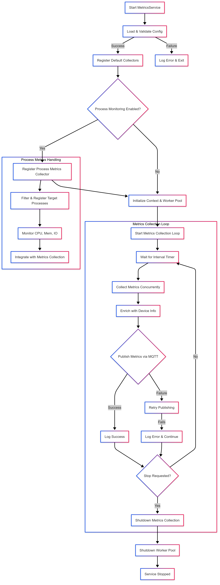

# **Metrics Service**

## **Overview**
The `MetricsService` is a telemetry collection and publishing system designed to gather key system metrics and transmit them via MQTT. It operates as a background service, collecting data periodically and ensuring that relevant system performance indicators are available for analysis and monitoring.

## **Service Flow**

### 1. **Initialization**
Upon instantiation using `NewMetricsService`, the service initializes various components:
- Loads configuration parameters such as the MQTT topic, polling intervals, and timeout settings.
- Sets up dependencies, including MQTT middleware, file operations, and device identity management.
- Establishes a metrics registry to track active metric collectors.
- Initializes a worker pool to enable concurrent data collection.
- Registers default metric collectors based on the provided configuration.

### 2. **Starting the Service**
When `Start` is called:
- The service verifies whether it is already running to prevent duplicate execution.
- It loads and validates the metrics configuration from an external file.
- Registers appropriate metric collectors based on the configuration.
- If specific process metrics are required, it ensures process monitoring is set up.
- A background worker is launched to periodically collect and publish metrics.

### 3. **Metrics Collection**
The core functionality revolves around the `RunMetricsCollectionLoop` method:
- At each configured interval, the service collects system metrics such as CPU, memory, disk, and network usage.
- Data collection is performed concurrently using the worker pool to avoid blocking operations.
- The collected data is enriched with device identity information before being prepared for transmission.

### 4. **Publishing Metrics**
Once collected, metrics are transmitted via MQTT:
- The data is serialized into JSON format for efficient transmission.
- MQTT middleware is used to publish the metrics to the configured topic with the specified Quality of Service (QoS) level.
- If publishing fails, the service retries multiple times with incremental backoff to improve reliability.

### 5. **Stopping the Service**
When `Stop` is invoked:
- The service cancels its running context, signaling the collection loop to halt gracefully.
- The worker pool is shut down to free resources.
- The service ensures that all active operations are properly terminated before exiting.