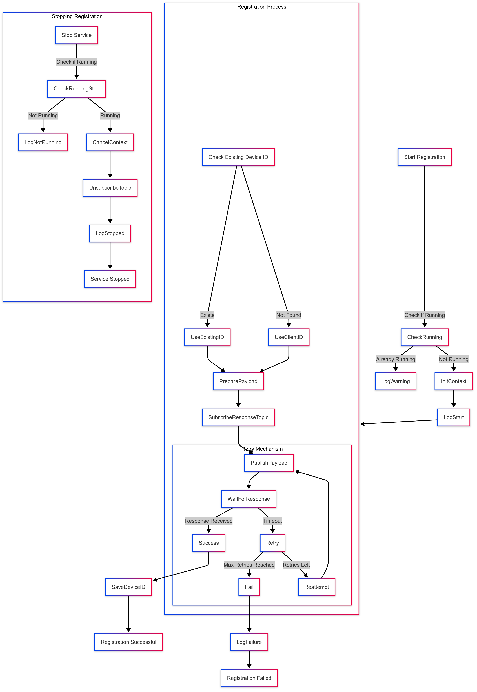

# Registration Service Documentation

## Overview

The Registration Service manages the device registration process, ensuring secure communication and proper state management during registration attempts. It handles the initial registration, re-registration when necessary, and interacts with the MQTT broker to send encrypted registration requests and receive responses.

### Flow of Execution

### Initialization

The service is initialized with necessary configurations including the MQTT topic, client ID, quality of service level, and maximum backoff time for retries. It also depends on various components such as the device identity manager, MQTT client, file operations, JWT manager, and encryption manager to handle secure communication and authentication.

### Start Process

When the service starts, it first checks if it is already running. If the service is active, it logs a warning and prevents multiple instances from executing. The service then initializes its execution context and launches the registration process in a separate goroutine. It logs the client ID and proceeds with the registration flow.

### Registration Flow

The registration process begins by checking if the device already has an assigned device ID. If a device ID exists, it verifies the validity of the stored JWT token. If the token is valid, the service logs that the device is already registered and does not attempt re-registration. If the token is invalid, the service proceeds with re-registration using the existing device ID. In cases where no device ID is found, the service constructs a registration payload containing the client ID, device identity information, and metadata before attempting registration.

### Retry Mechanism

The service implements an exponential backoff and jitter strategy for handling registration failures. It starts with a small retry interval, doubling it after each failed attempt while introducing a small random delay to prevent congestion. The maximum backoff interval ensures that retries do not continue indefinitely. During each retry, the service logs the attempt count and backoff duration before reattempting registration. If the service is stopped during a retry, it logs the shutdown event and exits gracefully.

### Registration Request

During registration, the service encrypts the registration payload before publishing it to the designated MQTT topic. It also subscribes to a response topic to receive the registration confirmation. Upon receiving a response, it verifies the payload, checks for a valid device ID and JWT token, and saves the received credentials. If any error occurs in the response processing, it logs the error and retries registration as needed. If no response is received within a defined timeout period, the service logs a timeout error and retries.

### Stop Process

When stopping the service, it ensures that all running goroutines are properly terminated. It cancels the execution context, waits for all active operations to complete, and resets internal states. Upon successful shutdown, it logs that the service has stopped cleanly. If the service is not running when a stop request is issued, it logs an appropriate error message.
