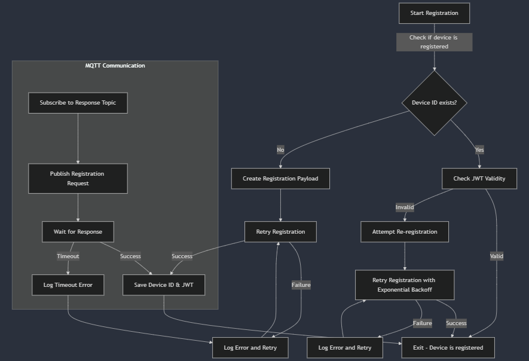

# Registration Service Documentation

## Overview
The `RegistrationService` is responsible for managing the device registration process by communicating with an MQTT broker. It ensures that each device is uniquely registered, receives a JWT token for authentication, and handles retries in case of failures. The service supports controlled exponential backoff for retrying failed registrations and runs until the device is successfully registered or explicitly stopped.



---

## **Struct: RegistrationService**

```go
// RegistrationService manages the device registration process.
type RegistrationService struct {
    PubTopic          string
    ClientID          string
    QOS               int
    DeviceInfo        identity.DeviceInfoInterface
    MqttClient        mqtt.MQTTClient
    FileClient        file.FileOperations
    JWTManager        jwt.JWTManagerInterface
    EncryptionManager encryption.EncryptionManagerInterface
    MaxBackoffSeconds int
    Logger            zerolog.Logger
    stopChan          chan struct{}
    running           bool
    mu                sync.Mutex
}
```

---

## **Fields:**

1. **`PubTopic` (string):**
   - The MQTT topic where registration requests are published.

2. **`ClientID` (string):**
   - The unique identifier of the client initiating registration.

3. **`QOS` (int):**
   - Quality of Service (QoS) level for MQTT message delivery:
     - `0`: At most once (fire and forget).
     - `1`: At least once (may receive duplicates).
     - `2`: Exactly once (ensures message delivery without duplication).

4. **`DeviceInfo` (identity.DeviceInfoInterface):**
   - Interface to fetch device-related information.

5. **`MqttClient` (mqtt.MQTTClient):**
   - The MQTT client instance for communication with the broker.

6. **`FileClient` (file.FileOperations):**
   - Used to handle file-based operations related to device registration.

7. **`JWTManager` (jwt.JWTManagerInterface):**
   - Manages JWT tokens for authentication.

8. **`EncryptionManager` (encryption.EncryptionManagerInterface):**
   - Handles encryption of sensitive registration payloads.

9. **`MaxBackoffSeconds` (int):**
   - Maximum duration for exponential backoff retries in case of registration failures.

10. **`Logger` (zerolog.Logger):**
    - Logger for debugging and tracking service behavior.

11. **`stopChan` (chan struct{}):**
    - Channel used to signal the termination of the registration process.

12. **`running` (bool):**
    - Tracks whether the service is currently running.

13. **`mu` (sync.Mutex):**
    - Ensures thread-safe modifications of the service state.

---

## **Methods:**

### **1. `Start()`**

Initializes the registration process. If a valid device ID exists and the JWT is valid, registration is skipped.

```go
func (rs *RegistrationService) Start() error
```

- **Steps:**
  1. Checks if the service is already running.
  2. Retrieves the device ID, if already registered.
  3. Validates the JWT token.
  4. If the device is not registered or the JWT is invalid, triggers the registration process.

- **Returns:**
  - `error`: If registration fails.

---

### **2. `retryRegistration(payload models.RegistrationPayload) error`**

Implements an exponential backoff retry mechanism for registration failures.

```go
func (rs *RegistrationService) retryRegistration(payload models.RegistrationPayload) error
```

- **Backoff Mechanism:**
  - Starts with a 1-second delay, doubling after each failure.
  - Adds jitter (random variation) to avoid synchronized retries.
  - Capped at `MaxBackoffSeconds`.

- **Returns:**
  - `nil`: On successful registration.
  - `error`: If retries exceed the maximum limit.

---

### **3. `Register(encryptedPayload []byte, deviceID string) error`**

Publishes the registration request and waits for a response.

```go
func (rs *RegistrationService) Register(encryptedPayload []byte, deviceID string) error
```

- **Steps:**
  1. Subscribes to the response topic.
  2. Publishes the encrypted registration payload.
  3. Waits for a response from the broker.
  4. If successful, saves the received JWT token.
  5. If no response within 10 seconds, returns a timeout error.

- **Returns:**
  - `nil`: On successful registration.
  - `error`: If registration fails or times out.

---

### **4. `Stop()`**

Gracefully stops the registration service.

```go
func (rs *RegistrationService) Stop() error
```

- **Returns:**
  - `error`: If the service is not running.

---

## **Registration Message Structure:**

### **1. `RegistrationPayload`**

Represents the registration request structure.

```go
type RegistrationPayload struct {
    ClientID string          `json:"client_id,omitempty"`
    DeviceID string          `json:"device_id,omitempty"`
    Name     string          `json:"device_name,omitempty"`
    OrgID    string          `json:"org_id,omitempty"`
    Metadata json.RawMessage `json:"metadata,omitempty"`
}
```

- **Fields:**
  - `ClientID`: Unique client identifier.
  - `DeviceID`: Unique device identifier (if pre-assigned).
  - `Name`: Device name.
  - `OrgID`: Organization ID associated with the device.
  - `Metadata`: Additional metadata in JSON format. This is a Json field. Prefix the keys with the group they belong to (eg: network_ip, storage_free_space, memory_cached, etc).

---

### **2. `RegistrationResponse`**

Represents the response received after successful registration.

```go
type RegistrationResponse struct {
    DeviceID string `json:"device_id"`
    JWTToken string `json:"jwt_token"`
}
```

- **Fields:**
  - `DeviceID`: Assigned device ID from the server.
  - `JWTToken`: JWT token for authentication.

---

## **Error Handling:**

1. **Serialization Errors:**
   - If `json.Marshal(payload)` fails, logs an error and aborts registration.

2. **Encryption Errors:**
   - If encryption fails, logs an error and stops the process.

3. **Publishing Errors:**
   - If MQTT publishing fails, logs an error and retries with exponential backoff.

4. **Timeout Handling:**
   - If no response is received within 10 seconds, logs an error and retries.

---