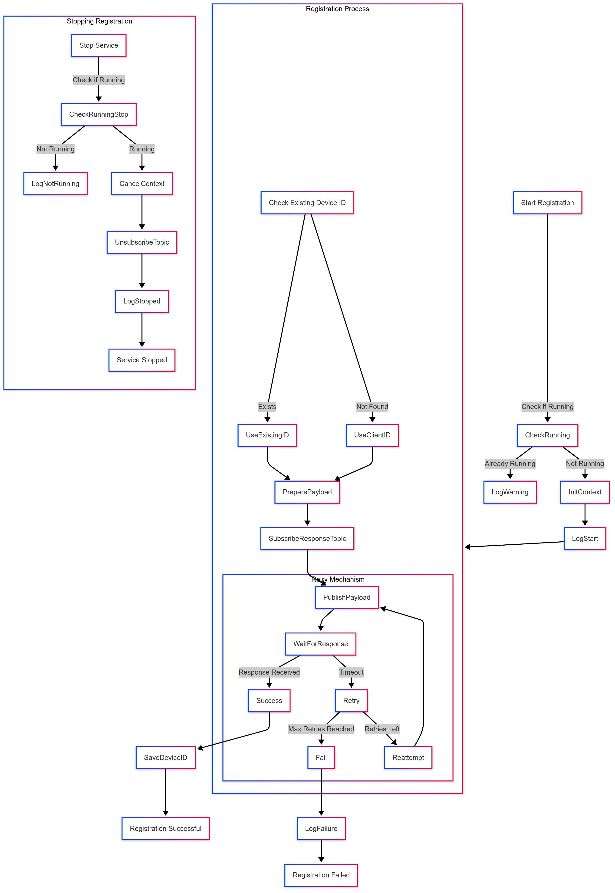

# **Registration Service**

## Overview
The **Registration Service** is responsible for handling the onboarding and registration of IoT devices with a backend system using MQTT. It ensures that devices can securely register themselves, receive a unique Device ID if necessary, and persist that identity for future communication.

## **Key Features**
- Supports both new device registration and existing device re-registration.
- Implements an MQTT-based request-response mechanism for registration.
- Supports retry logic with exponential backoff and jitter to handle network instability.
- Allows dynamic handling of Device ID and Client ID for seamless onboarding.
- Provides a graceful shutdown mechanism to ensure clean service termination.

## **Registration Flow**

### 1. **Service Initialization**
Upon creation, the `RegistrationService` is configured with the necessary parameters, such as:
- MQTT topics for publishing and subscribing.
- Device information handlers.
- A middleware for MQTT authentication.
- File operations for storing device identity.

### 2. **Starting the Service**
Calling `Start()` initiates the registration process if it is not already running. It performs the following steps:
1. Checks if an existing registration process is already running.
2. Creates a new execution context (`context.Context`) to manage the lifecycle of the process.
3. Calls the `Run()` method to determine whether the device is already registered.

### 3. **Device Registration Process**
#### a) Checking for Existing Device ID
- If the device has already been registered (i.e., it has a stored Device ID), it attempts to re-register using that ID.
- If no Device ID exists, it registers as a new device using the Client ID.

#### b) Sending Registration Request via MQTT
- A payload containing device details is constructed.
- A response topic is determined based on whether the Device ID exists.
- The service subscribes to the response topic to listen for server acknowledgment.
- The payload is serialized and published to the MQTT broker.

#### c) Handling the Registration Response
- The service waits for a response within a specified timeout period.
- If a valid Device ID is received in the response, it is stored for future use.
- If no response is received, the service retries with an exponential backoff mechanism to avoid overloading the server.

### 4. **Error Handling and Retries**
- If registration fails, the service retries up to the configured maximum attempts.
- Each retry introduces a randomized delay (jitter) to prevent multiple devices from retrying simultaneously.
- If all attempts fail, an error is logged, and the service reports a timeout failure.

### 5. **Stopping the Service**
The `Stop()` method is responsible for safely shutting down the registration process:
1. It cancels the execution context, preventing further retries.
2. It unsubscribes from the MQTT response topic to clean up resources.
3. It resets the internal state, making the service ready for future registration attempts.