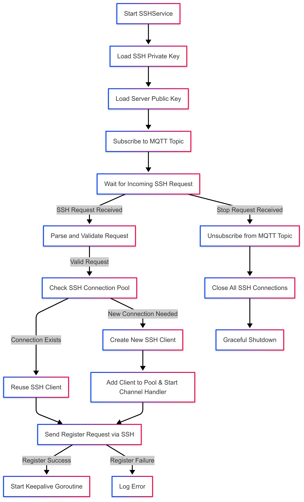

# **SSH Service**

## **Overview**

The **SSH Service** enables dynamic, secure, and controlled SSH tunnel establishment between the IoT agent and remote backend services. It listens for SSH tunnel requests over MQTT, validates and processes these requests, and sets up persistent SSH connections to facilitate port forwarding. The service is designed for reliability, concurrency, and graceful shutdown.

---

## **Service Flow**

### 1. **Initialization**
- Configurable parameters such as MQTT topic, QoS level, SSH credentials, connection limits, and timeouts are provided.
- Reads and parses the SSH private key and expected server public key using a file client.
- Initializes internal structures, including connection maps, contexts, and synchronization primitives.
- Injects necessary dependencies like MQTT middleware, logger, device identity, and file operations.

---

### 2. **Starting the Service**
- Loads the private and public SSH keys from the provided paths.
- Parses and caches them for future use.
- Subscribes to an MQTT topic that includes the device ID (e.g., `ssh/requests/<device_id>`).
- Begins listening for SSH tunnel setup requests via MQTT.

---

### 3. **Handling Incoming Requests**
- Parses incoming MQTT messages into an `SSHRequest` object containing:
  - `BackendHost`, `BackendPort`: The SSH server to connect to.
  - `LocalPort`, `RemotePort`: The desired local and remote port mapping.
- Processes requests asynchronously to maintain responsiveness.

---

### 4. **Establishing SSH Tunnel**
- Validates connection limits before proceeding.
- Reuses existing SSH connections to the same backend if available.
- If a new connection is required:
  - Creates an SSH client config using the cached private key.
  - Establishes an SSH connection with the backend.
  - Registers the tunnel by sending a `register` request over the SSH channel.
- Begins listening for SSH channels using `handleAgentChannels`.

---

### 5. **Handling Agent Channels**
- Accepts channels of type `direct-tcpip` over the SSH connection.
- Each channel is handled in a goroutine for concurrency.
- Forwards TCP data between the backend service and the SSH channel in both directions using `io.Copy`.
- Tracks open channels and ensures clean shutdowns on disconnect or errors.

---

### 6. **Monitoring and Keepalive**
- A periodic keepalive request is sent to each active SSH client to verify connectivity.
- On disconnect or failure, the connection is cleaned up and removed from the client map.
- Each SSH connection is monitored in its own goroutine.

---

### 7. **Graceful Shutdown**
- Cancels the service context to signal shutdown.
- Unsubscribes from MQTT to stop receiving requests.
- Closes all active SSH connections and waits for all goroutines to complete via `sync.WaitGroup`.
