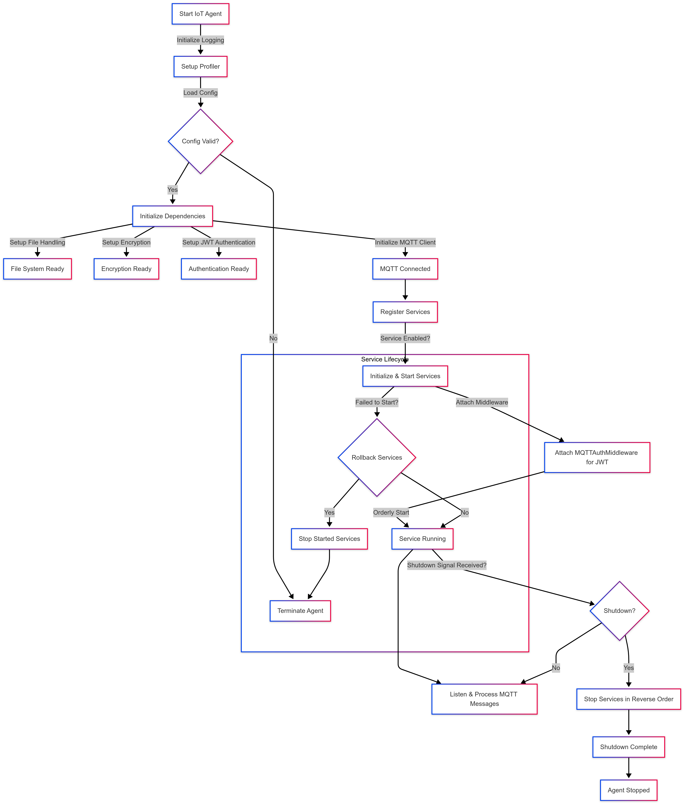

# IoT Agent Documentation

## Overview
The IoT Agent is a critical component responsible for managing communication between IoT devices and the central platform. It ensures secure and reliable connectivity while providing essential services such as device registration, heartbeat monitoring, command execution, and more. The agent is designed in a modular fashion, allowing for easy extension and customization. By leveraging MQTT for communication and implementing strong encryption and authentication mechanisms, the IoT Agent offers a robust framework for enterprise-grade IoT deployments.

## **Flow of Execution**

When the IoT Agent starts, it first initializes its logging system, ensuring that logs are properly structured and filtered based on the environment settings. This makes it easier to debug and monitor system behavior. A profiler is also launched, which allows for performance monitoring and debugging when necessary.

Next, the agent loads its configuration from a file, which contains critical information such as MQTT broker details, security settings, and service enablement flags. If any required configuration is missing, the agent logs an error and terminates to prevent running in an unstable state.

Once the configuration is loaded, the agent sets up its core dependencies. This includes initializing the file handling system, which is responsible for reading and writing local files; setting up encryption services to manage secure communication; and loading the JWT authentication mechanism, which ensures that only authorized devices can interact with the platform. The MQTT client is then initialized, establishing a connection with the broker using a unique Client ID generated at runtime to prevent conflicts.

After the core dependencies are ready, the agent moves on to service registration. The **Service Registry** is responsible for managing all available services. Each service is initialized and added to the registry based on the configuration. Services such as registration, heartbeat, metrics collection, command execution, and secure shell (SSH) access are registered in a structured manner, ensuring that they start in the correct order. If any service fails to start, the system rolls back previously started services to maintain consistency.

Once all services are successfully initialized, the IoT Agent begins running. It continuously listens for MQTT messages and processes them based on the registered service logic. Throughout its operation, the agent logs all significant events, errors, and service activities to facilitate monitoring and debugging.

To ensure a graceful shutdown, the agent listens for termination signals from the system. When a shutdown request is received, services are stopped in reverse order to prevent dependency issues. If any errors occur during shutdown, they are logged for further investigation.

## **Understanding the Service Registry**

The **Service Registry** plays a crucial role in managing the lifecycle of services within the IoT Agent. It ensures that each service is initialized correctly, started in a controlled manner, and stopped gracefully when necessary.

Services are registered dynamically based on the configuration. Each service is given a unique identifier, allowing it to be managed efficiently. Dependencies such as MQTT, file handling, and encryption are injected into each service at the time of registration to ensure smooth operation.

When the agent starts its services, they are launched sequentially in a predefined order. If any service encounters an issue during startup, the system halts further execution and shuts down previously started services to avoid inconsistencies. Similarly, during shutdown, services are stopped in reverse order to ensure a smooth and error-free process.

## **List of Available Services**

The **Registration Service** is responsible for handling device authentication and authorization. When a device connects to the platform, this service verifies its identity and registers it accordingly.

The **Heartbeat Service** ensures that devices remain connected and active by periodically sending status updates. If a device stops sending heartbeats, it may be considered offline or in need of maintenance.

The **Metrics Service** collects valuable system data such as CPU usage, memory utilization, and network activity. This information is transmitted to the central platform for analysis and monitoring.

The **Command Service** listens for incoming execution requests and runs commands on the IoT device. This allows administrators to remotely control and manage devices without requiring direct access.

The **SSH Service** enables secure remote access to IoT devices over an MQTT channel. This service provides an additional layer of security by allowing administrators to troubleshoot devices without exposing standard SSH ports.

The **Location Service** determines the device’s geographical position using GPS sensors or network-based geolocation. This is particularly useful for mobile IoT devices that need to report their location periodically.

The **Update Service** is responsible for handling firmware and software updates. It ensures that IoT devices receive the latest security patches and feature enhancements without requiring manual intervention.

## **Extending the System**

The IoT Agent is designed to be flexible and easily extendable. Developers who wish to add new services can follow a straightforward process. First, they need to create a new service that implements the standard service interface. Next, the service must be registered within the **Service Registry**, ensuring it is properly initialized and managed. Finally, the configuration file can be updated to enable or disable the new service as needed. This modular approach ensures that the system remains scalable and adaptable to new requirements.
